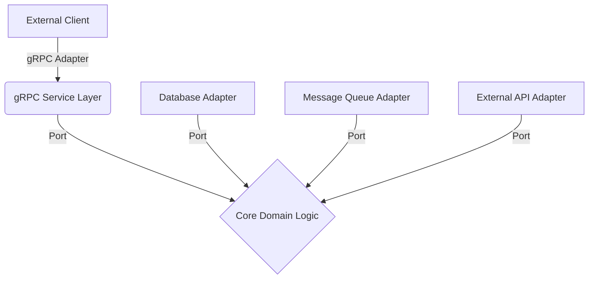
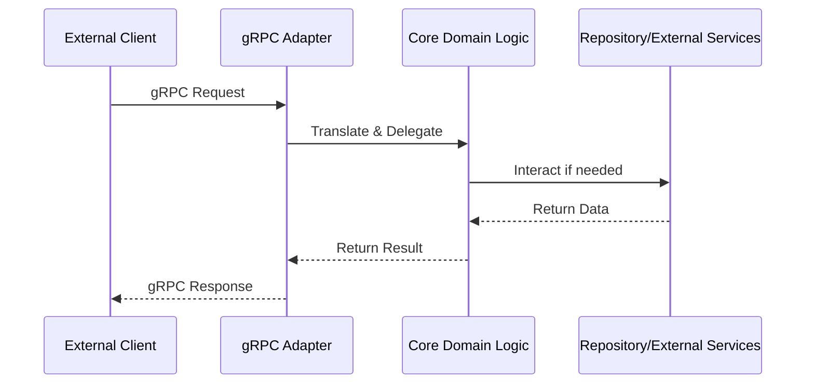
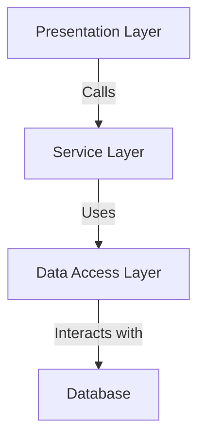
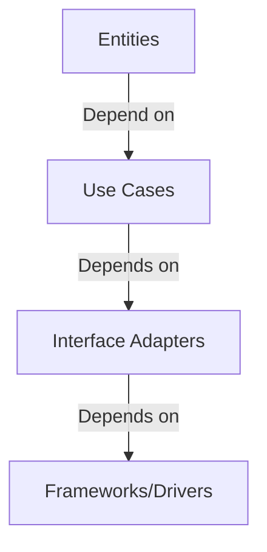
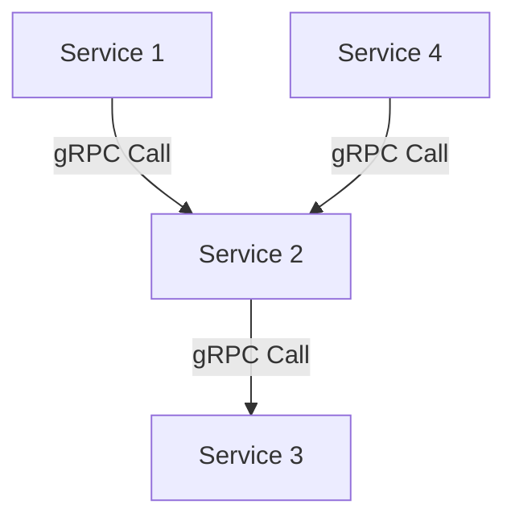

# gRPC Architecture Exploration

## 1. Hexagonal Architecture (Ports and Adapters) in gRPC

### Overview
  * Hexagonal Architecture, also known as Ports and Adapters Architecture, is a design approach that aims to create loosely coupled application components with clear separation of concerns.

### Core Principles
  - **Isolation of Core Business Logic**: The central domain logic is completely independent of external concerns
  - **Flexibility in Connections**: Multiple input and output adapters can connect to the core application
  - **Testability**: Easy to test core logic in isolation

### Architectural Components



### Implementation Details

#### 1. Core Domain Layer

```go
// Core domain interface representing the primary port
type UserService interface {
    CreateUser(ctx context.Context, user *User) error
    GetUser(ctx context.Context, userID string) (*User, error)
}

// Core domain implementation
type userServiceImpl struct {
    userRepository UserRepository
}

func (s *userServiceImpl) CreateUser(ctx context.Context, user *User) error {
    // Pure business logic, no external dependencies
    if err := s.validateUser(user); err != nil {
        return err
    }
    return s.userRepository.Save(user)
}
```

#### 2. Adapter Layer (gRPC)

```go
// gRPC Adapter - translates gRPC requests to domain logic
type UserServiceAdapter struct {
    service UserService
}

func (a *UserServiceAdapter) CreateUser(ctx context.Context, req *pb.CreateUserRequest) (*pb.CreateUserResponse, error) {
    // Translate gRPC request to domain model
    user := &User{
        Name: req.Name,
        Email: req.Email,
    }
    
    // Delegate to core domain logic
    err := a.service.CreateUser(ctx, user)
    if err != nil {
        return nil, status.Errorf(codes.Internal, "Failed to create user: %v", err)
    }
    
    return &pb.CreateUserResponse{}, nil
}
```

### Advantages of Hexagonal Architecture in gRPC
  1. **Decoupling**: Separates core business logic from external frameworks
  2. **Flexibility**: Easy to swap out adapters (gRPC, REST, GraphQL)
  3. **Testability**: Core logic can be tested without external dependencies

### Challenges
  1. Initial complexity
  2. Potential performance overhead
  3. Requires disciplined design

### Flow Diagram



## 2. Alternative gRPC Architectural Patterns

### 1. Layered Architecture



### 2. Clean Architecture



### 3. Microservices Architecture with gRPC



## Comparative Analysis

| Architecture | Coupling | Complexity | Testability | Scalability |
|--------------|----------|------------|-------------|-------------|
| Hexagonal    | Low      | Medium     | High        | Medium      |
| Layered      | Medium   | Low        | Medium      | Low         |
| Clean        | Low      | High       | High        | Medium      |
| Microservices| Very Low | High       | Medium      | Very High   |

## Best Practices for gRPC Architecture
  1. Keep core domain logic pure and framework-agnostic
  2. Use dependency injection
  3. Implement robust error handling
  4. Design clear port interfaces
  5. Use value objects and immutability

## Conclusion

   * Hexagonal Architecture offers a robust approach to designing gRPC services, providing flexibility,
     testability, and clear separation of concerns.
