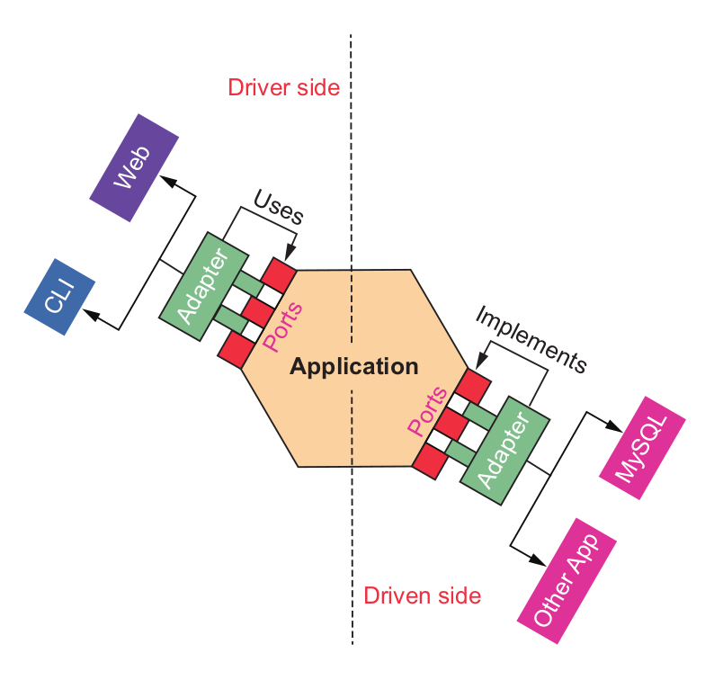

# Hexagonal Architecture

  * A pattern designed for loosely coupled application that are connected via ports and
    adapters.

  * In this pattern, the consumer opens the application at a port via an adapter, and the
    output is sent through a port to an adapter

  * **Actors**

    * Entities that interact with the application, which can be humans, other appications
      or hardware devices

      * There are two type of actors

        * **Driver(Primary) Actors** : Initiate communication with application

        * **Driven(Secondary) Actors** : Responds to the reuqest

  * **Ports**

    * Interfaces that define interactions b/w actors and application.

    * driver ports expose actions that can peform, while driven ports are used for reciving
      data  or commands from application
        

  * **Diagram**

    

  * **Adapters**

    * **Driver Adapter** : This `adapter` transform input from user actors into a format that
      the application can understand. It acts as bridge b/w user interface. It acts as a bridge
      b/w the user interface and the core logic

    * **Driven Adapter** : This `adapter` transform data from the application into a format
      suitable for external systems, such as database quaries or API calls

# Load Balancing

  * **Server-Side Load Balacing**

    * In server-side load balancing a client will make RPC call to the load-balacer and
      it will distribute the request among the available services


      ```mermaid
      stateDiagram-v2
          state "Server-Side Load Balancing" as ServerLB {
              [*] --> Client
              Client --> LoadBalancer : RPC Request
              LoadBalancer --> ServiceInstance1 : Distribute
              LoadBalancer --> ServiceInstance2 : Distribute
              LoadBalancer --> ServiceInstance3 : Distribute
          }
    
          state "Client-Side Load Balancing" as ClientLB {
              [*] --> Client
              Client --> ServiceInstance1 : Direct RPC
              Client --> ServiceInstance2 : Direct RPC
              Client --> ServiceInstance3 : Direct RPC
              ServiceInstance1 --> Client : Load Report
              ServiceInstance2 --> Client : Load Report
              ServiceInstance3 --> Client : Load Report
          }
      ```

      * There are different kind of load balancing techniques are used in load balacing


        1) **Round Robin** : Distribute requests sequentially and rotate though available
           services.


        ```mermaid
        graph TD
            A[Client Request Dispatcher] -->|Maintain Counter| B{Round-Robin Selector}
            B -->|Counter % Service Count| C[Service Registry]
    
            C -->|Service 1| D[Payment Service #1]
            C -->|Service 2| E[Payment Service #2]
            C -->|Service 3| F[Payment Service #3]
    
            B -->|Select Next Service| G[Selected Service Instance]
            G -->|Route Request| H[Backend Service]
    
            subgraph Request Routing Logic
                A --> B
                B --> C
                B --> G
            end
    
            subgraph Tracking Mechanism
                I[Request Counter]
                J[Service List]
                K[Current Index Tracker]
            end
        ```

        2) **Least Connections** : Routes to a service with fewer active connections
           and prevents overloading busy services


        ```mermaid
        graph TD
            A[Client Request Manager] -->|Connection Tracking| B{Least Connections Algorithm}
    
            subgraph Connection Tracking
                C[Service #1 Connections: 2]
                D[Service #2 Connections: 1]
                E[Service #3 Connections: 3]
            end
    
            B -->|Analyze Active Connections| F[Select Lowest Connection Service]
            F -->|Route to Least Loaded| G[Backend Service Instance]
    
            subgraph Dynamic Load Metrics
                H[Active Connection Counter]
                I[Response Time Tracker]
                J[Service Health Monitor]
            end
    
            A -->|Update Metrics| K[Connection Pool Manager]
            K -->|Maintain Connection State| L[Service Registry]
        ```

        3) **Weighted Distribution** : Assigns weights to services this is by checking
           configuration of availabe systems i.e if machine-1 has 8gb ram and machine-2
           has 16gb ram and machine-3 has 4gb ram so the wwight would be 2, 3, and 1 and
           by checking load it is likely to send request on more resourcfule machine


        ```mermaid
        graph TD
            A[Client Request Distributor] -->|Weight-Based Selection| B{Weighted Selector}
    
            subgraph Weight Configuration
                C[Service #1: Weight 3]
                D[Service #2: Weight 2]
                E[Service #3: Weight 1]
            end
    
            B -->|Calculate Probability| F[Weighted Random Selection]
            F -->|Route Based on Weight| G[Backend Service Instance]
    
            subgraph Weight Calculation
                H[Cumulative Weight Sum]
                I[Normalized Weight Percentage]
                J[Probabilistic Distribution]
            end
    
            A -->|Dynamic Reconfiguration| K[Weight Adjustment Manager]
            K -->|Update Service Weights| L[Service Registry]
        ```

        4) **Load Aware Routing** : Monitor metrics like cpu, memory, response_time and
           error rate of the micro services and based on that make decisions.

        ```mermaid
        graph TD
            A[Client Request Orchestrator] -->|Performance Monitoring| B{Load-Aware Router}
    
            subgraph Performance Metrics
                C[CPU Utilization]
                D[Memory Usage]
                E[Response Time]
                F[Error Rate]
            end
    
            B -->|Aggregate Metrics| G[Score Calculation Engine]
            G -->|Compute Service Score| H[Service Performance Ranking]
    
            H -->|Select Best Performer| I[Optimal Service Instance]
            I -->|Route Request| J[Backend Service]
    
            subgraph Adaptive Learning
                K[Machine Learning Model]
                L[Historical Performance Data]
                M[Predictive Load Forecasting]
            end
    
            A -->|Continuous Learning| N[Performance Feedback Loop]
            N -->|Update Models| O[Service Intelligence Manager]
        ```
