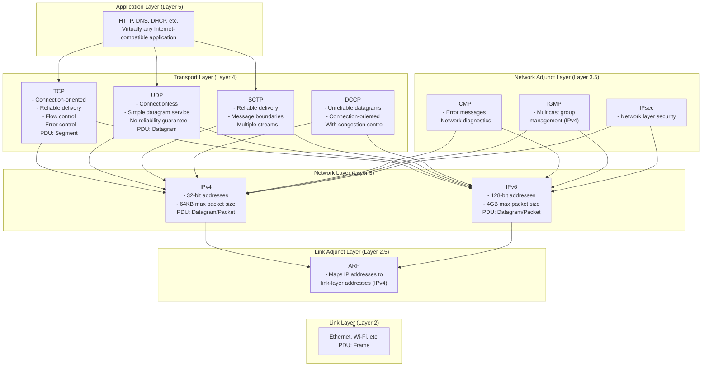

# `ARPANET`

## Introduction
 * The ARPANET Reference Model (ARM) is the foundation of the TCP/IP suite used in the modern Internet.
   Compared to the OSI model, it has a simpler structure but includes specialized protocols that don't
   fit neatly into conventional layers.

 * To ensure that the network was fault-tolerent, ARPANEET used a disrtibuted routing algorithum
   that allwed each noode to make its own decisions about the best path for data to take. Each
   node was quipped with a special-purpose computer called an Interface Message Protocol (IMP)
   responsible for routing data b/w nodes.
   
## TCP/IP Layer Structure

### Layer 5: Application Layer
- **Function**: Handles application-specific details and protocols
- **Examples**: HTTP (Web), DNS, DHCP
- **Characteristics**: 
  - Virtually any Internet-compatible application
  - Focuses on application functionality rather than data movement

### Layer 4: Transport Layer
- **Function**: Provides exchange of data between abstract "ports"
- **Examples**: 
  - **TCP**: Connection-oriented, reliable data delivery
    - Provides flow control and error correction
    - Divides data into appropriately sized chunks
    - Acknowledges received packets
    - Sets timeouts for packet acknowledgment
    - PDU: TCP segment
  - **UDP**: Simple, connectionless datagram service
    - Provides port numbers for multiplexing/demultiplexing
    - Includes data integrity checksum
    - No guarantees of delivery
    - Application must implement reliability if needed
  - **SCTP**: Reliable delivery like TCP but with message abstraction
    - Doesn't require strict data sequencing
    - Allows multiple streams on one connection
    - Designed for telephone network signaling
  - **DCCP**: Hybrid between TCP and UDP
    - Connection-oriented exchange of unreliable datagrams
    - Implements congestion control

### Layer 3: Network Layer
- **Function**: Defines abstract datagrams and provides routing
- **Core Protocol**: IP (Internet Protocol)
  - **IPv4**: 32-bit addresses, max size 64KB
  - **IPv6**: 128-bit addresses, max size up to 4GB
- **Characteristics**:
  - Uses IP addresses to identify sender and recipient
  - Performs forwarding based on destination address
  - Handles fragmentation when packets are too large
  - Supports unicast, broadcast, and multicast addressing
  - **PDU**: IP datagram (commonly called "packet")

### Layer 3.5: Network Adjunct Layer
- **Function**: Helps with setup, management, and security for network layer
- **Examples**:
  - **ICMP** (Internet Control Message Protocol)
    - Used to exchange error messages and vital information
    - Two versions: ICMPv4 (for IPv4) and ICMPv6 (for IPv6)
    - ICMPv6 includes additional functions like address autoconfiguration
    - Can be used by diagnostic tools like ping and traceroute
  - **IGMP** (Internet Group Management Protocol)
    - Used with IPv4 multicast addressing
    - Manages multicast group membership
  - **MLD** (Multicast Listener Discovery)
    - Used with IPv6 multicast addressing
  - **IPsec**
    - Provides security at the network layer

### Layer 2.5: Link Adjunct Layer
- **Function**: Maps network layer addresses to link layer addresses
- **Examples**:
  - **ARP** (Address Resolution Protocol)
    - Used with IPv4 on multi-access link-layer networks
    - Converts between IP addresses and link-layer addresses
    - Not used with IPv6 (function handled by ICMPv6)

### Layer 2: Link Layer ("Driver")
- **Function**: Handles direct node-to-node data transfer
- **PDU**: Frame
- **Characteristics**:
  - Specific to the network hardware (Ethernet, Wi-Fi, etc.)
  - Handles physical addressing

## Key Concepts

### IP Addressing
- **IPv4**: 32-bit addresses, becoming scarce
- **IPv6**: 128-bit addresses, main difference from IPv4
- **Address Types**:
  - **Unicast**: Destined for a single host
  - **Broadcast**: Destined for all hosts on a network
  - **Multicast**: Destined for a specific group of hosts

### Fragmentation
- Process of breaking large IP datagrams into smaller pieces
- Performed when datagrams exceed the maximum size supported by the link layer
- Fragments are reassembled at the destination

### Forwarding
- Process of sending a datagram to its next hop
- Based on the destination IP address
- Performed by both routers and hosts (more commonly by routers)

## Protocol Data Units (PDUs)
- **Application Layer**: Messages
- **Transport Layer**: Segments (TCP) or Datagrams (UDP)
- **Network Layer**: IP Datagrams/Packets
- **Link Layer**: Frames

## TCP vs UDP Comparison

| Feature | TCP | UDP |
|---------|-----|-----|
| Connection | Connection-oriented (VC) | Connectionless |
| Reliability | Reliable data delivery | No reliability guarantees |
| Message Boundaries | Does not preserve | Preserves |
| Flow Control | Yes | No |
| Error Control | Yes | Minimal (checksum only) |
| Overhead | Higher | Lower |
| Speed | Generally slower | Faster |
| Use Case | Applications requiring reliability | Applications prioritizing speed |
