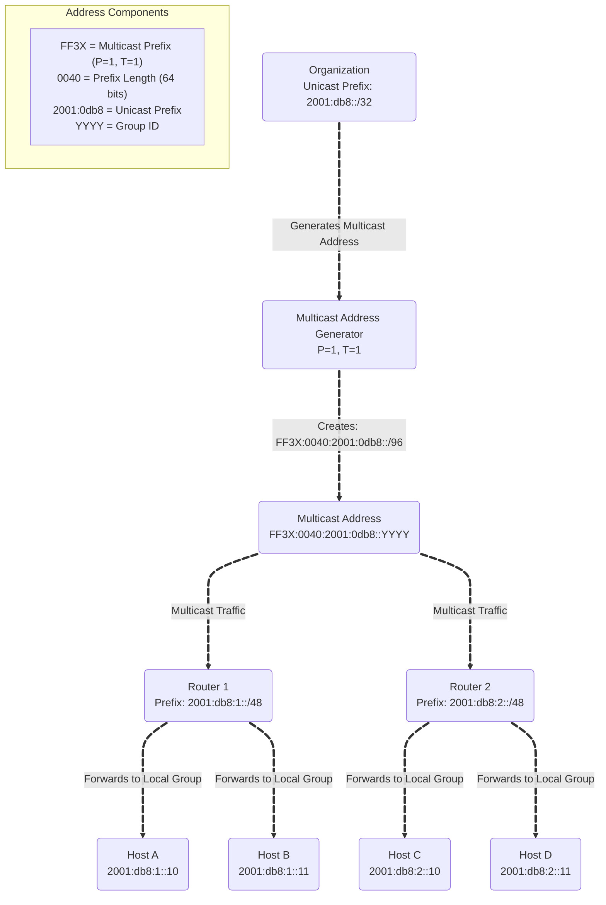

# IPv6 Multicast Addresses - Study Notes

## Overview
IPv6 uses multicast addresses more aggressively than IPv4. The prefix `ff00::/8` is reserved for multicast addresses with 112 bits available for group numbers, providing for 2^112 possible groups (approximately 5.19 × 10^33 groups).

## Basic IPv6 Multicast Address Format

### Structure
```
8 bits    4 bits  4 bits      112 bits
ff        Flags   Scope       Group ID
```

### Flag Bits (4 bits)


---
# Rendezvous Point (RP) - Detailed Explanation

A **Rendezvous Point (RP)** is a centralized router in multicast networks that acts as a meeting place for multicast sources and receivers when they initially do not know about each other.


## Core Concept

Think of an RP as a **"bulletin board" or "post office"** for multicast traffic:

- **Sources** send their multicast data to the RP.
- **Receivers** initially connect to the RP to discover sources.
- The RP helps establish the **optimal multicast distribution tree** for efficient data delivery.


## How Rendezvous Points Work

### Initial Phase (Shared Tree)

- **Source Registration:** When a source wants to send multicast traffic, it registers with the RP.
- **Receiver Join:** Receivers join the multicast group by sending join messages toward the RP.
- **Shared Tree Formation:** A shared multicast tree (Rendezvous Point Tree, RPT) is built with the RP as the root.

### Optimization Phase (Source Tree)

- **Source Discovery:** Receivers learn about active sources through the RP.
- **Tree Switching:** Receivers can switch from the shared tree to **source-specific trees** (Shortest Path Trees, SPT) for better efficiency.
- **Direct Communication:** Eventually, multicast traffic may flow directly from source to receivers, bypassing the RP to optimize the path.


## Why Rendezvous Points Are Needed

### The Bootstrap Problem

- **Challenge:** In large networks, multicast sources and receivers do not initially know each other.
- **Solution:** The RP provides a well-known meeting point, like a **town square** where people gather to find others with common interests.

### Scalability

- Without RP: Every router would need to maintain state for every possible source.
- With RP: Only the RP needs to track all sources initially, reducing memory and processing requirements on edge routers.


## Multicast Protocols Using RPs

| Protocol       | Use Case                      | Operation                              | Advantage                                |
|----------------|-------------------------------|--------------------------------------|-----------------------------------------|
| **PIM-SM**     | Sparse multicast environments | Uses RPs for initial tree construction | Efficient for groups with few receivers relative to network size |
| **PIM-BiDir**  | Many-to-many communication    | All traffic flows through the RP     | Simplified state management              |


## RP Selection and Management

- **Static Configuration:** Manually configure RP addresses on all routers. Simple but not scalable; single point of failure.
- **Auto-RP (Cisco proprietary):** Candidate RPs announce themselves; dynamic RP selection.
- **Bootstrap Router (BSR):** Standards-based RP discovery (RFC 5059); elects RPs for different group ranges; provides redundancy and load distribution.
- **Anycast RP:** Multiple RPs share the same IP address; enables automatic failover and load balancing; coordinated using MSDP (Multicast Source Discovery Protocol).


## RP in IPv6 Context

- **R Flag:** Indicates multicast groups that use RP procedures, helping routers optimize multicast forwarding.
- **Embedded RP:** IPv6 allows embedding RP information directly in multicast addresses (e.g., FF7x::/12), enabling self-contained addressing without external RP configuration.


## Advantages of Rendezvous Points

- **Efficiency:**  
  - Sparse mode only creates forwarding state where needed.  
  - Conserves bandwidth by avoiding flooding in sparse receiver scenarios.  
  - Optimizes router memory and CPU usage.
- **Manageability:**  
  - Centralized control point for policy enforcement.  
  - Simplifies monitoring and troubleshooting multicast groups.


## Disadvantages and Limitations

- **Single Point of Failure:** RP failure can disrupt multicast communication; mitigated by redundant or anycast RPs.
- **Suboptimal Paths:** Initial traffic may take longer paths through RP; switching to source-specific trees optimizes this.
- **Scalability Limits:** RP can become a bottleneck for very large groups; mitigated by multiple RPs for different group ranges.


## Real-World Example

In a corporate video conference scenario:

- Without RP: Every router must know every video source.
- With RP:  
  - Video sources register with the RP.  
  - Participants join the conference through the RP.  
  - RP facilitates initial connection.  
  - Once established, video may flow directly between participants for efficiency.


## Modern Developments

- **Source-Specific Multicast (SSM):** Receivers specify both group and source, reducing the need for RPs in many scenarios and eliminating RP-related complexity.
- **Automatic Tunneling:** Used in multicast over IPv6; RP remains important for PIM-SM operations and integration with modern overlay networks.

---

### Scope Field (4 bits)
Indicates the distribution limit of multicast datagrams:

| Value | Scope |
|-------|-------|
| 0 | Reserved |
| 1 | Interface-/machine-local |
| 2 | Link-/subnet-local |
| 3 | Reserved |
| 4 | Admin |
| 5 | Site-local |
| 6-7 | Unassigned |
| 8 | Organizational-local |
| 9-d | Unassigned |
| e | Global |
| f | Reserved |

**Examples:**
1. `ff02::1` - All nodes on the same link/subnet
2. `ff05::2` - All routers at the same site

## Variable-Scope Multicast Addresses

Many IPv6 multicast addresses span multiple scopes using the format `ff0x::`, where `x` represents the variable scope.

**Examples:**
1. NTP servers across different scopes:
   - `ff01::101` - All NTP servers on the same machine
   - `ff02::101` - All NTP servers on the same link/subnet
   - `ff05::101` - All NTP servers at the same site
   - `ff0e::101` - All NTP servers in the Internet

2. mDNSv6 across different scopes:
   - `ff01::fb` - mDNSv6 on node scope
   - `ff02::fb` - mDNSv6 on link scope
   - `ff05::fb` - mDNSv6 on site scope

## Unicast-Prefix-Based IPv6 Multicast (P bit = 1)

### Purpose
Provides globally unique IPv6 multicast addresses without requiring new global allocation mechanisms by leveraging existing unicast prefix allocations.

### Format
```
8 bits   4 bits  4 bits   8 bits    8 bits     64 bits    32 bits
ff       Flags   Scope    Reserved  Prefix     Prefix     Group ID
                          (for SSM) Length
```

### Rules
- When P bit = 1, T bit must also = 1
- Uses existing unicast prefix allocations
- Reduces global coordination requirements

**Examples:**
1. Organization with unicast prefix `3ffe:ffff:1::/48`:
   - Receives multicast prefix: `ff3x:30:3ffe:ffff:1::/96`
   - Example multicast address: `ff32:30:3ffe:ffff:1::1234` (link-local scope)

2. SSM (Source-Specific Multicast) format:
   - Prefix length and prefix fields set to 0
   - Uses format: `ff3x::/32` where x is any valid scope
   - Example: `ff32::/32` for link-local SSM block


### Working diagram



## Link-Scoped IPv6 Multicast (IID-based)

### Purpose
Creates unique multicast addresses for link-local scope using Interface IDs, preferred when only link-local scope is required.

### Format
```
8 bits   4 bits  4 bits   8 bits    8 bits     64 bits    32 bits
ff       Flags   Scope    Reserved  Prefix     IID        Group ID
                                    Length
```

### Characteristics
- Uses prefix format: `ff3x:0011/32`
- Scope (x) must be 2 or less
- No complex agreement protocol needed
- Suitable for ad hoc networks

**Examples:**
1. Host with IID `02-11-22-33-44-55-66-77`:
   - Multicast address format: `ff3x:0011:0211:2233:4455:6677:gggg:gggg`
   - Example: `ff32:0011:0211:2233:4455:6677:1234:5678` (link-local scope)

2. Host with IID `fe80::1`:
   - Multicast address: `ff32:0011:0000:0000:0000:0001:abcd:ef01`
   - Simplified: `ff32:0011::1:abcd:ef01`

## Rendezvous Point (RP) Embedded Addresses (R bit = 1)

### Purpose
Embeds the IPv6 address of a Rendezvous Point directly in the multicast address for PIM-SM protocol routing.

### Format
```
8 bits   4 bits  4 bits   8 bits    4 bits     8 bits     64 bits    32 bits
ff       Flags   Scope    Reserved  RIID       Prefix     Prefix     Group ID
                                              Length
```

### RP Address Extraction Process
1. Extract bits indicated by Prefix Length from Prefix field
2. Use as upper bits of RP address
3. Use RIID field as low-order 4 bits
4. Fill remaining bits with zeros

**Examples:**
1. Multicast address: `ff75:940:2001:db8:dead:beef:f00d:face`
   - Scope: 5 (site-local)
   - RIID: 9
   - Prefix Length: 0x40 = 64 bits
   - Prefix: `2001:db8:dead:beef`
   - RP Address: `2001:db8:dead:beef::9`

2. Multicast address: `ff35:a20:3ffe:1234:5678:9abc:def0:1234`
   - Scope: 5 (site-local)
   - RIID: a
   - Prefix Length: 0x20 = 32 bits
   - Prefix: `3ffe:1234`
   - RP Address: `3ffe:1234::a`

## Common Reserved IPv6 Multicast Addresses

### Node-Local Scope (ff01::)
- `ff01::1` - All nodes
- `ff01::2` - All routers

### Link-Local Scope (ff02::)
- `ff02::1` - All nodes
- `ff02::2` - All routers
- `ff02::5` - OSPFIGP routers
- `ff02::6` - OSPFIGP designated routers
- `ff02::9` - RIPng routers
- `ff02::16` - MLDv2-capable routers
- `ff02::1:2` - All DHCP agents
- `ff02::1:ffxx:xxxx` - Solicited-node address range

### Site-Local Scope (ff05::)
- `ff05::2` - All routers
- `ff05::1:3` - All DHCP servers

### Special Use Addresses
- `ff3x::/32` - SSM (Source-Specific Multicast) block
- `ff0x::fb` - mDNSv6 (variable scope)
- `ff0x::101` - NTP servers (variable scope)

**Examples:**
1. DHCP communication:
   - Client to server: `ff02::1:2` (All DHCP agents on link)
   - Server response: `ff05::1:3` (All DHCP servers on site)

2. Router discovery:
   - `ff02::1` - Host sends to all nodes on link
   - `ff02::2` - Host sends to all routers on link

## Key Points Summary

1. **Scope Control**: IPv6 multicast provides fine-grained control over multicast distribution through scope fields
2. **Address Allocation**: Multiple methods (permanent, unicast-prefix-based, IID-based) reduce global coordination needs
3. **Routing Integration**: RP embedding in addresses simplifies multicast routing protocols
4. **Backwards Compatibility**: Maintains interoperability while providing enhanced functionality
5. **Scalability**: 112-bit group space provides virtually unlimited multicast groups
