# `Link Layer`


```text

wlo1: flags=4163<UP,BROADCAST,RUNNING,MULTICAST>  mtu 1500
        inet 192.168.2.3  netmask 255.255.255.0  broadcast 192.168.2.255
        inet6 fe80::4dc:61ee:b080:e945  prefixlen 64  scopeid 0x20<link>
        inet6 2001:e280:3e14:116:bb07:9a4d:54a6:bd04  prefixlen 64  scopeid 0x0<global>
        inet6 2001:e280:3e14:116:1e12:478b:cd6a:8c75  prefixlen 64  scopeid 0x0<global>
        RX packets 230414  bytes 290634978 (290.6 MB)
        RX errors 0  dropped 0  overruns 0  frame 0
        TX packets 57077  bytes 12135506 (12.1 MB)
        TX errors 0  dropped 0 overruns 0  carrier 0  collisions 0
```

* MTU is maximum transmission unit that is upperbound in data packet size which can be transferred
  MTU (Maximum Transmission Unit) size of 1500 refers to 1500 bytes

* The choice of 1500 bytes as the MTU is historical and balances efficiency and hardware limitations
  from early Ethernet days. Larger MTUs, called jumbo frames (up to around 9000 bytes) they are present
  but not recommeded to use beacuse of compatibility issues.


## IEEE 802 LAN/MAN  Standards

| Standard | Name | Description |
|----------|------|-------------|
| 802.1ak | Multiple Registration Protocol (MRP) | Protocol for multiple registration services |
| 802.1AE | MAC Security (MACSec) | Media Access Control security protocol |
| 802.1AX | Link Aggregation | Link aggregation protocol (formerly 802.3ad) |
| 802.1d | MAC Bridges | Media Access Control bridge protocol |
| 802.1p | Traffic Classes/Priority/QoS | Quality of Service and traffic prioritization |
| 802.1q | Virtual Bridged LANs | Virtual LAN protocol with corrections to MRP |
| 802.1s | Multiple Spanning Tree Protocol (MSTP) | Enhanced spanning tree protocol |
| 802.1w | Rapid Spanning Tree Protocol (RSTP) | Rapid convergence spanning tree protocol |
| 802.1X | Port-Based Network Access Control (PNAC) | Network access control protocol |
| 802.2 | Logical Link Control (LLC) | Logical link layer control protocol |
| 802.3 | Baseline Ethernet and 10Mb/s Ethernet | Standard Ethernet protocol |
| 802.3u | 100Mb/s Ethernet ("Fast Ethernet") | Fast Ethernet protocol |
| 802.3x | Full-duplex operation and flow control | Full-duplex Ethernet with flow control |
| 802.3z/802.3ab | 1000Mb/s Ethernet ("Gigabit Ethernet") | Gigabit Ethernet protocol |
| 802.3ae | 10Gb/s Ethernet ("Ten-Gigabit Ethernet") | Ten-Gigabit Ethernet protocol |
| 802.3ad | Link Aggregation | Link aggregation protocol |
| 802.3af | Power over Ethernet (PoE) | Power over Ethernet up to 15.4W |
| 802.3ah | Access Ethernet ("Ethernet in the First Mile (EFM)") | First mile Ethernet access |
| 802.3at | Frame format extensions | Frame format extensions up to 2000 bytes |
| 802.3ba | Power over Ethernet enhancements ("PoE+") | Enhanced PoE up to 30W and 40/100Gb/s Ethernet |
| 802.11a | 54Mb/s Wireless LAN at 5GHz | Wireless LAN protocol at 5GHz frequency |
| 802.11b | 11Mb/s Wireless LAN at 2.4GHz | Wireless LAN protocol at 2.4GHz frequency |
| 802.11e | QoS enhancement for 802.11 | Quality of Service enhancements for wireless |
| 802.11g | 54Mb/s Wireless LAN at 2.4GHz | High-speed wireless LAN at 2.4GHz |
| 802.11h | Spectrum/power management extensions | Spectrum and power management for wireless |
| 802.11i | Security enhancements/replaces WEP | Enhanced wireless security protocol |
| 802.11j | 4.9–5.0GHz operation in Japan | Japan-specific wireless frequency operation |
| 802.11n | 6.5–600Mb/s Wireless LAN | High-speed wireless with MIMO and 40MHz channels |
| 802.11s | Mesh networking, congestion control | Wireless mesh networking protocol |
| 802.11y | 54Mb/s wireless LAN at 3.7GHz (licensed) | Licensed wireless LAN at 3.7GHz |
| 802.16 | Broadband Wireless Access Systems (WiMAX) | Broadband wireless access standard |
| 802.16d | Fixed Wireless MAN Standard (WiMAX) | Fixed wireless metropolitan area network |
| 802.16e | Fixed/Mobile Wireless MAN Standard (WiMAX) | Fixed and mobile wireless MAN |
| 802.16h | Improved Coexistence Mechanisms | Enhanced coexistence for wireless systems |
| 802.16j | Multihop Relays in 802.16 | Multihop relay mechanisms for WiMAX |
| 802.16k | Bridging of 802.16 | Bridging mechanisms for WiMAX |
| 802.21 | Media Independent Handovers | Media-independent handover protocols |

## Ethernet Frame Format

* The Ethernet frame format is the standardized structure that defines how data is packaged
  and transmitted over Ethernet networks


## MPE (Manchester Phase Encoding)


## IEEE Packet


---

# 802.1p/q Virtual LANs and QoS Tagging

## Introduction to Virtual LANs (VLANs)

### Background and Problem Statement
With the widespread adoption of switched Ethernet networks, it became possible to interconnect all computers at a site on the same physical Ethernet LAN. While this approach offered several advantages, it also introduced significant challenges:

**Advantages:**
- Direct communication between any hosts using IP and network-layer protocols
- Minimal administrator configuration required
- Efficient broadcast and multicast traffic distribution
- Simplified network topology

**Challenges:**
- **Broadcast Storm Issues**: Broadcast traffic going to every computer can create an undesirable amount of network traffic when many hosts use broadcast
- **Security Concerns**: Complete any-to-any station communication may pose security risks
- **Network Segmentation**: Large, multiuse switched networks lack logical separation

### VLAN Solution
To address some of these problems with running large, multiuse switched networks, IEEE extended the 802 LAN standards with a capability called virtual LANs (VLANs) in a standard known as 802.1q. VLANs provide logical network segmentation within a single physical infrastructure.

**Key VLAN Characteristics:**
- Compliant Ethernet switches isolate traffic among hosts to common VLANs
- Two hosts on the same switch but different VLANs require a router for communication
- Provides broadcast domain separation without physical network changes

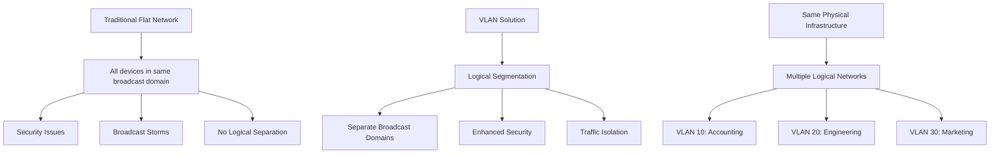

---

## 802.1Q VLAN Standard

### Frame Structure and Tagging Process
The 802.1Q standard defines how VLAN information is embedded into Ethernet frames through a process called tagging.

**Tagging Process:**
1. The 802.1Q tag is inserted into the frame, situated between the source MAC address and payload
2. A 16-bit field set to a value of 0x8100 in order to identify the frame as an IEEE 802.1Q-tagged frame
3. It works by inserting a VLAN tag into the header of an Ethernet frame and allows switches and other network devices to identify and process the frame through something called a VLAN membership

### Frame Types
802.1Q trunks support two types of frames: tagged and untagged. An untagged frame does not carry any VLAN identification information. A tagged frame carries VLAN identification information.

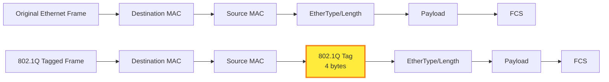

---

## VLAN Tag Structure

### 802.1Q Tag Components
802.1Q tag is a 32-bit (or 4-byte) field between the Source MAC address and the EtherType. It comprises two main fields, the Tag Protocol Identifier (TPID) field.

### VLAN Identifier Details
12-bit VLAN identifier (VID) field that supports up to 4,096 unique VLANs, though VLAN 0 and VLAN 4095 are reserved for special purposes.

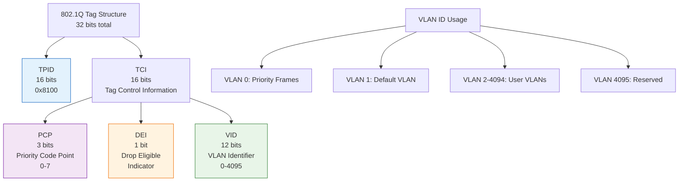

---

## 802.1p Quality of Service (QoS)

### QoS Overview
802.1p is a quality of service (QoS)/class of service (CoS) method that operates at the MAC layer (Layer 2). Equipment that supports 802.1p can add and recognize a value that indicates the priority level of the Ethernet frame.

### Priority Code Point (PCP) Field
The QoS technique developed by the working group, also known as class of service (CoS), is a 3-bit field called the Priority Code Point.

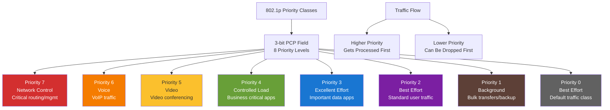

---

## VLAN Assignment Methods

### Assignment Options
Several methods are used to specify the station-to-VLAN mapping, each with distinct advantages and use cases.

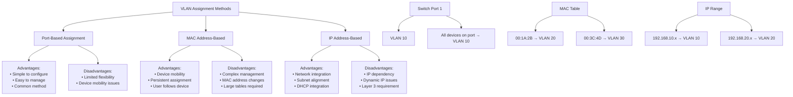

---

## VLAN Trunking

### Trunking Concept and Purpose
The primary idea behind this is to be able to transport frames from multiple VLANs over a single physical link between switches.

### Trunking Configuration Requirements
In many cases, the administrator must configure the ports of the switch to be used to send 802.1p/q frames by enabling trunking on the appropriate ports.

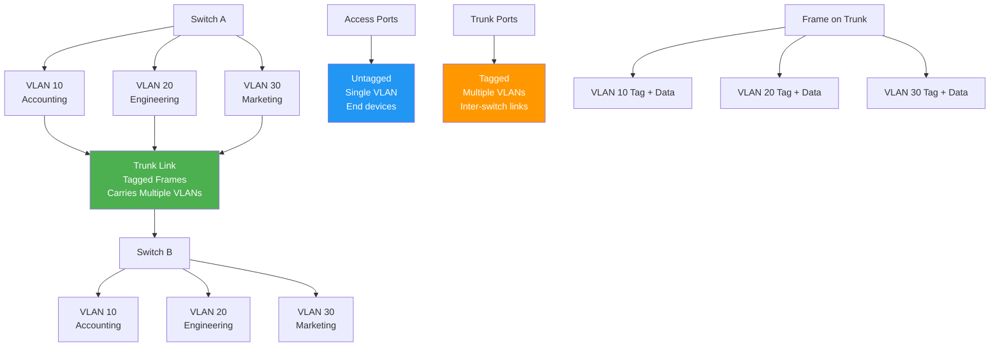

---

## Native VLAN Concept

### Native VLAN Definition and Purpose
The native VLAN, within the context of VLAN trunk links, is a default VLAN that carries untagged traffic.

### Native VLAN Benefits
Native VLAN concept has been introduced as a way to provide backward compatibility to a device that doesn't support VLAN tagging.

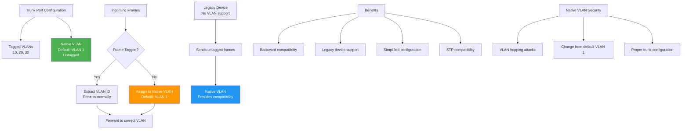

---

## Implementation and Configuration

### Linux VLAN Configuration
The Linux command for manipulating 802.1p/q information is called vconfig.

### Advanced Configuration Options
An 802.1Q VLAN tagging interface can be created on top of bridge, bond, and team interfaces.

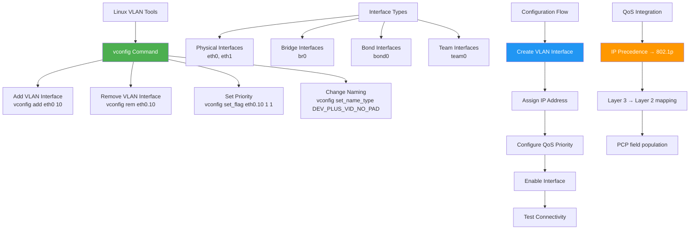

---

## Benefits and Limitations

### VLAN Benefits
VLANs provide logical separation without physical changes, broadcast domain control, enhanced security through traffic isolation, and flexible network design.

### Current Industry Perspective
Combination switch/router devices have been created to address this need, and ultimately the performance of routers has been improved to match the performance of VLAN switching. Thus, the appeal of VLANs has diminished somewhat, in favor of modern high-performance routers.

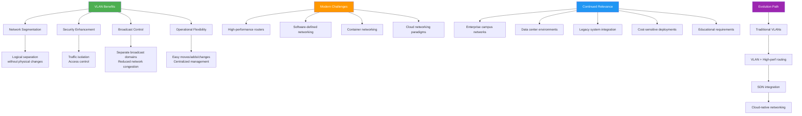

---

## Network Topology Example

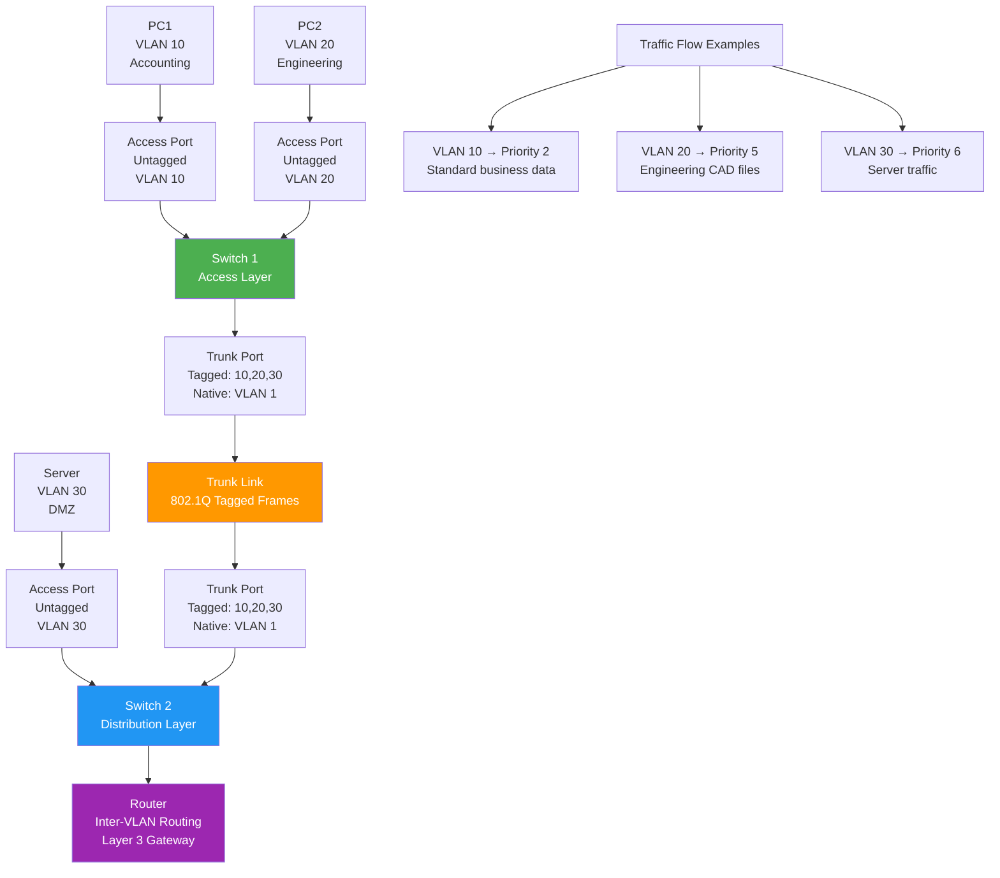

---

## Frame Processing Workflow

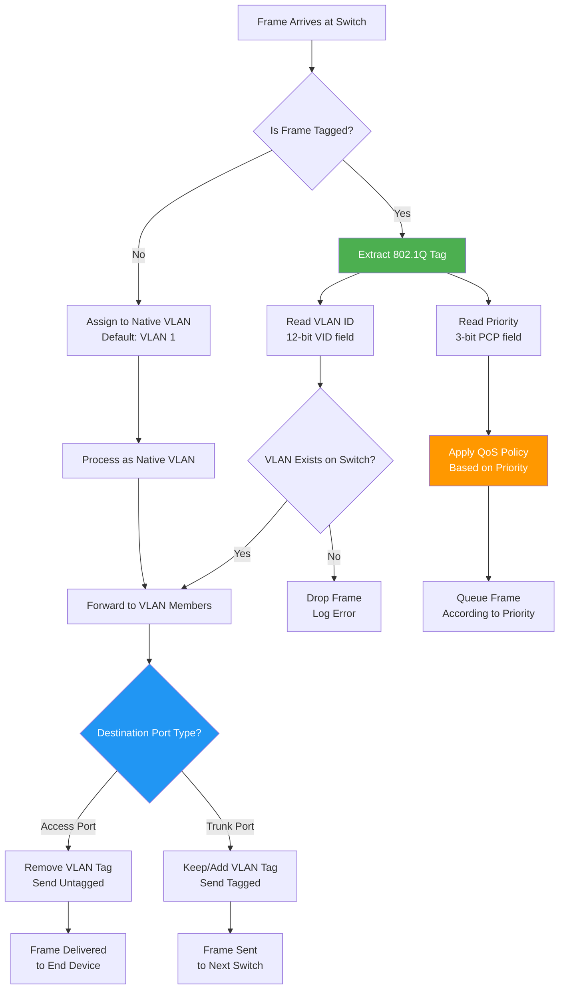

---

## VLAN


# Link Aggrigation (802.1AX)


## Real-Time Industry Applications

1. Enterprise Data Centers
  
  * Application: Server-to-Switch Connectivity
    
    * Implementation: Multiple 10/25/40 Gbps links bonded per server
    
    * Benefits: Higher bandwidth for virtualized environments, redundancy for critical applications
    
    * Configuration: Typically uses Mode 4 (802.3ad) with LACP for automatic failover
    
    * Case Study: Large enterprises bond 4 × 10 Gbps links to achieve 40 Gbps effective bandwidth with 3+1 redundancy. If one link fails, remaining three continue operation with 30 Gbps capacity.

2. Cloud Service Providers
  
  * Application: Inter-Switch Links (ISLs)
    
    * Implementation: High-density 100 Gbps+ aggregated links between core switches
    
    * Benefits: Massive bandwidth scaling, seamless failover
    
    * Advanced Feature: Dynamic load balancing based on real-time traffic patterns

    * Real Example: AWS data centers use link aggregation for spine-leaf architectures, bonding multiple 100 Gbps links between leaf and spine switches to handle massive east-west traffic flows.

3. Financial Services
  
  * Application: High-Frequency Trading (HFT) Networks

    * Implementation: Ultra-low latency trading systems with redundant paths

    * Benefits: Microsecond-level failover, guaranteed connectivity to exchanges
    
    * Specialized Configuration: Custom bonding with hardware timestamping

    * Critical Requirement: Sub-millisecond failover times require specialized network interface cards with hardware-based link aggregation and immediate path switching capabilities.

4. Telecommunications
  * Application: 5G Network Infrastructure
    
    * Implementation: Carrier aggregation at base stations and core network
    
    * Benefits: Bandwidth scaling for massive IoT and mobile broadband
    
    * Integration: Combined with Software-Defined Networking (SDN) for dynamic resource allocation

    * 5G Specific Use: Link aggregation enables combining multiple fiber optic connections from cell towers to core networks, providing the backhaul capacity needed for 5G's high data rates.

5. Healthcare Systems
    
  * Application: Medical Imaging and Telemedicine

    * Implementation: Hospital network infrastructure with guaranteed bandwidth

    * Benefits: Reliable transfer of large medical images, real-time video consultations

    * Compliance: Meets HIPAA requirements for network reliability and redundancy

    * Critical Application: Remote surgery systems require guaranteed network availability and bandwidth. Link aggregation provides the redundancy and performance needed for life-critical applications.

6. Content Delivery Networks (CDNs)
  
  * Application: Edge Server Connectivity
  
    * Implementation: CDN edge servers with multiple high-bandwidth connections
    
    * Benefits: Improved content delivery speeds, geographic load distribution
    
    * Performance: Reduces latency for streaming services and web content

    * Industry Impact: Major streaming platforms use link aggregation at edge locations to ensure consistent 4K/8K video delivery during peak usage periods.

7. Educational Institutions

  * Application: Campus Network Backbone

    * Implementation: University networks connecting dormitories, academic buildings
    
    * Benefits: Cost-effective bandwidth scaling, future-proof infrastructure
    
    * Scale: Supports thousands of simultaneous users with varying bandwidth needs

    * Research Networks: Universities conducting data-intensive research use link aggregation to connect to national research networks like Internet2, enabling collaboration on big data projects.


### Advanced Technical Implementations

1. Multi-Chassis Link Aggregation (MLAG)
  
  * Concept: Extends link aggregation across multiple physical switches
  
  * Benefit: Eliminates single points of failure in network design
  
  * Implementation: Requires specialized switch hardware and synchronization protocols

  * Use Case: Data centers deploy MLAG to connect servers to two different switches simultaneously, ensuring network availability even if an entire switch fails.

2. Dynamic Load Balancing Algorithms
  
  * Hash-Based Distribution:

  * Layer 2: Source/Destination MAC addresses

  * Layer 3: Source/Destination IP addresses
  
  * Layer 4: TCP/UDP port numbers
  
  * Custom: Application-specific flow identification


## Network Interface Concepts: Full Duplex, Power Save, Auto-negotiation, 802.1X, and Flow Control

```bash
$ sudo ethtool eth0
Settings for eth0:
        Supported ports: [ TP    MII ]
        Supported link modes:   10baseT/Half 10baseT/Full
                                100baseT/Half 100baseT/Full
                                1000baseT/Half 1000baseT/Full
        Supported pause frame use: Transmit-only
        Supports auto-negotiation: Yes
        Supported FEC modes: Not reported
        Advertised link modes:  10baseT/Half 10baseT/Full
                                100baseT/Half 100baseT/Full
                                1000baseT/Half 1000baseT/Full
        Advertised pause frame use: Transmit-only
        Advertised auto-negotiation: Yes
        Advertised FEC modes: Not reported
        Link partner advertised link modes:  10baseT/Half 10baseT/Full
                                             100baseT/Half 100baseT/Full
                                             1000baseT/Half 1000baseT/Full
        Link partner advertised pause frame use: Symmetric Receive-only
        Link partner advertised auto-negotiation: Yes
        Link partner advertised FEC modes: Not reported
        Speed: 1000Mb/s
        Duplex: Full
        Auto-negotiation: on
        master-slave cfg: preferred slave
        master-slave status: slave
        Port: Twisted Pair
        PHYAD: 1
        Transceiver: external
        MDI-X: Unknown
        Supports Wake-on: ag
        Wake-on: d
        Link detected: yes
```


  * `The negotiation process`

     
    * Advertisement Phase: Each device advertises its capabilities
      ```bash
      Advertised link modes:  10baseT/Half 10baseT/Full
                       100baseT/Half 100baseT/Full
                       1000baseT/Half 1000baseT/Full
      ```

    * Partner Detection: Devices detect what the other end supports

      ```bash
      Link partner advertised link modes:  10baseT/Half 10baseT/Full
                                    100baseT/Half 100baseT/Full
                                    1000baseT/Half 1000baseT/Full
      ```


---

# Bridges and Switches


   


---

# STP Port States and Roles

## Overview
Spanning Tree Protocol (STP) uses a state machine for each port on every bridge/switch to prevent loops in Ethernet networks. Understanding port states and roles is crucial for network topology management.

## Port States in STP

### The Five Port States

1. **Blocking State**
   - Initial state after initialization
   - **Cannot**: Learn MAC addresses, forward frames, or transmit BPDUs
   - **Can**: Monitor and receive BPDUs
   - Purpose: Wait for potential inclusion in spanning tree path

2. **Listening State** 
   - Transition from blocking when port might be needed
   - **Can**: Send and receive BPDUs
   - **Cannot**: Learn MAC addresses or forward data frames
   - Duration: Temporary state during topology calculation

3. **Learning State**
   - Follows listening state after forwarding delay (15 seconds)
   - **Can**: Learn MAC addresses, send/receive BPDUs
   - **Cannot**: Forward data frames yet
   - Purpose: Build MAC address table before forwarding

4. **Forwarding State**
   - Final operational state for active ports
   - **Can**: Do everything - learn addresses, forward frames, handle BPDUs
   - Duration: Another forwarding delay (15 seconds) from learning state

5. **Disabled State**
   - Administratively shut down
   - **Cannot**: Participate in any STP operations
   - Triggered by: Manual configuration or hardware failure

### State Transition Timing
- **Forwarding Delay**: 15 seconds (typical)
- **Total Transition Time**: Blocking → Listening → Learning → Forwarding = ~30 seconds
- **Max Age**: Time to wait for BPDUs before declaring topology change

## Port Roles in STP

### Root Port
- **Definition**: Port with best path toward root bridge
- **Characteristics**:
  - One per bridge (except root bridge)
  - Always in forwarding state when active
  - Receives BPDUs from root direction
- **Selection Criteria**: Lowest root path cost

### Designated Port
- **Definition**: Port responsible for forwarding to attached segment
- **Characteristics**:
  - One per network segment
  - Always in forwarding state
  - Sends BPDUs to segment
  - Represents least-cost path to root for that segment

### Alternate Port
- **Definition**: Backup path to root bridge
- **Characteristics**:
  - Higher cost path than current root port
  - Remains in blocking state
  - Can become root port if primary path fails
  - Provides redundancy

### Backup Port
- **Definition**: Secondary port on same segment as designated port
- **Characteristics**:
  - Connected to same segment as another port on same bridge
  - Remains in blocking state
  - Can replace failing designated port quickly
  - Doesn't provide alternate root path

## Key Concepts Explained

### Why Port States Matter
The gradual transition through states prevents:
- **Temporary loops** during topology changes
- **MAC address table corruption** 
- **Broadcast storms**

### RSTP State Names (in parentheses from diagram)
- Blocking → **Discarding**
- Listening → **Discarding** 
- Learning → **Learning**
- Forwarding → **Forwarding**
- Disabled → **Discarding**

### Administrative vs. Automatic Transitions
- **Solid arrows**: Normal STP operations
- **Dashed arrows**: Manual configuration changes
- **Topology changes** can trigger state transitions

## Important Timing Values

| Parameter | Typical Value | Purpose |
|-----------|---------------|---------|
| Forwarding Delay | 15 seconds | Time between state transitions |
| Max Age | 20 seconds | BPDU timeout period |
| Hello Time | 2 seconds | BPDU transmission interval |

## Practical Implications

### Network Convergence
- **Convergence Time**: Up to 50 seconds for complete topology change
- **Port Recovery**: 30 seconds for port to become operational
- **Impact**: Temporary connectivity loss during transitions

### Troubleshooting Tips
1. **Stuck in Learning**: Check for BPDU conflicts
2. **Frequent State Changes**: Look for unstable links
3. **Long Convergence**: Verify timer configurations
4. **Disabled Ports**: Check physical connections and admin status

### Modern Improvements
- **RSTP (802.1w)**: Faster convergence (2-3 seconds)
- **Per-VLAN STP**: Separate spanning trees per VLAN
- **MST**: Multiple spanning trees for better load balancing

## Best Practices

1. **Root Bridge Placement**: Position at network core
2. **Port Priorities**: Manually configure for predictable paths  
3. **PortFast**: Enable on end-device ports to skip listening/learning
4. **BPDU Guard**: Protect against unauthorized bridges
5. **Monitor State Changes**: Log transitions for troubleshooting

---

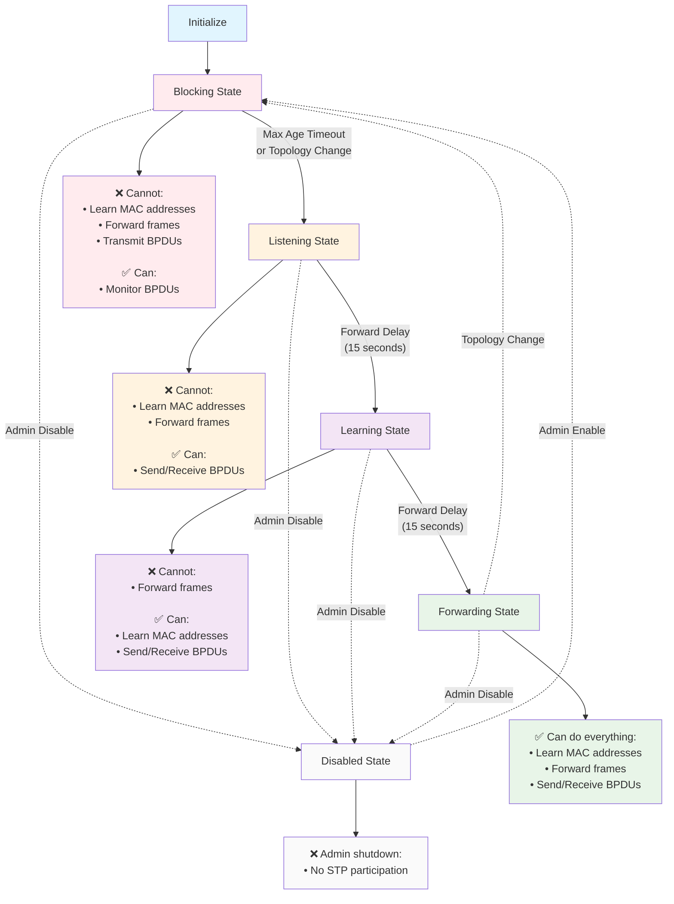
---

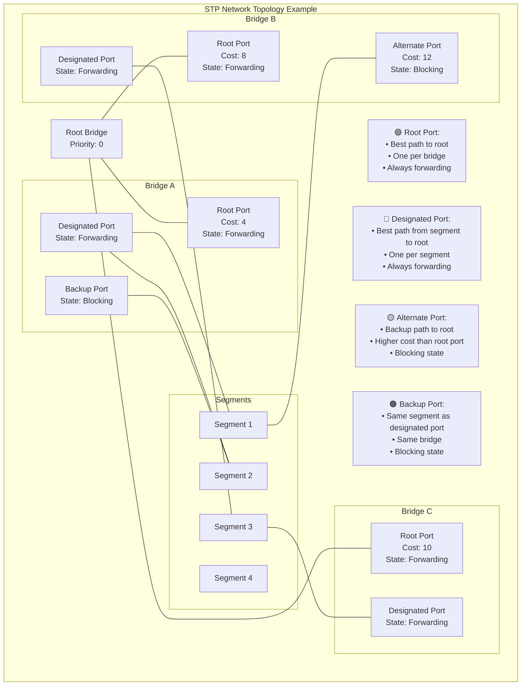

---

```mermaid
gantt
    title STP Port State Convergence Timeline
    dateFormat X
    axisFormat %s
    
    section Port Activation
    Blocking State          :blocking, 0, 20
    Listening State         :listening, 20, 35  
    Learning State          :learning, 35, 50
    Forwarding State        :active, forwarding, 50, 80
    
    section Key Events
    BPDU Reception         :milestone, bpdu1, 5
    Topology Decision      :milestone, decision, 20
    Start Learning MACs    :milestone, mac_learn, 35
    Begin Forwarding       :milestone, forward_start, 50
    Full Operation         :milestone, full_op, 50
    
    section Timing Parameters
    Max Age (20s)          :crit, max_age, 0, 20
    Forward Delay 1 (15s)  :crit, fd1, 20, 35
    Forward Delay 2 (15s)  :crit, fd2, 35, 50
    
    section Recovery Scenario  
    Link Failure           :milestone, failure, 60
    Topology Change        :topo_change, 60, 65
    Reconvergence          :reconv, 65, 95

```

# BPDU Structure and Format

## Overview
Bridge Protocol Data Units (BPDUs) are the control messages used by Spanning Tree Protocol (STP) to build and maintain loop-free network topologies. Understanding BPDU structure is crucial for network troubleshooting and STP operation.

## BPDU Frame Structure

### Ethernet Header (14 bytes)
- **Destination (DST)**: `01:80:C2:00:00:00` (Bridge group multicast address)
- **Source (SRC)**: MAC address of sending bridge port
- **Length/Type (L/T)**: Frame length or EtherType field

### LLC/SNAP Header (3 bytes)
- **LLC/SNAP**: `0x424203` (constant value for BPDUs)
- **Purpose**: 802.1 standard encapsulation
- **Note**: Not all BPDUs use LLC/SNAP, but it's common

## BPDU Payload Fields

### Protocol Identification
| Field | Size | Value | Description |
|-------|------|-------|-------------|
| **Protocol (Prot)** | 2 bytes | 0 | Protocol ID number |
| **Version (Vers)** | 1 byte | 0 or 2 | STP=0, RSTP=2 |
| **Type** | 1 byte | 0 or 2 | Message type |

### Flags Field (1 byte)
Critical for STP operation and RSTP enhancements:

#### Original STP Flags
- **TC (Topology Change)**: Bit indicates topology change
- **TCA (Topology Change Acknowledgment)**: Acknowledges TC

#### RSTP Additional Flags  
- **P (Proposal)**: Port role negotiation
- **Port Role** (2 bits): 
  - 00 = Unknown
  - 01 = Alternate/Backup
  - 10 = Root  
  - 11 = Designated
- **L (Learning)**: Port learning state
- **F (Forwarding)**: Port forwarding state
- **A (Agreement)**: Agreement to proposal

### Bridge Identification Fields

#### Root ID (8 bytes)
- **Structure**: 2-byte Priority + 6-byte MAC Address
- **Purpose**: Identifies root bridge as seen by sender
- **Priority**: Default varies (Cisco uses 0x8000/32768)
- **Selection**: Lowest combined value becomes root

#### Bridge ID (8 bytes)  
- **Structure**: 2-byte Priority + 6-byte MAC Address
- **Purpose**: Identifies the sending bridge
- **Usage**: Used in root bridge election process

### Path Information
| Field | Size | Description |
|-------|------|-------------|
| **Root Path Cost** | 4 bytes | Cost to reach root bridge |
| **Port ID (PID)** | 2 bytes | 1-byte Priority + 1-byte Port Number |

### Timing Parameters (All in 1/256 second units)
| Field | Size | Default | Purpose |
|-------|------|---------|---------|
| **Message Age (MsgA)** | 2 bytes | Variable | Hop count from root |
| **Maximum Age (MaxA)** | 2 bytes | 20s | BPDU timeout value |
| **Hello Time** | 2 bytes | 2s | BPDU transmission interval |
| **Forward Delay** | 2 bytes | 15s | Learning/Listening state duration |

## Message Age Field Operation

### Special Behavior
- **Root Bridge**: Sets Message Age = 0 when sending
- **Receiving Bridges**: Increment by 1 before forwarding
- **Function**: Acts as hop counter through spanning tree
- **Timeout Calculation**: (MaxA - MsgA) = remaining lifetime

### Timeout Process
1. BPDU received with Message Age value
2. Information stored for (MaxA - MsgA) time
3. If no new BPDU received before timeout:
   - Root bridge declared "dead"
   - Root election process restarts

## BPDU Types and Versions

### Standard STP (802.1D)
- **Version**: 0
- **Type**: 0 (Configuration BPDU)
- **Special**: TCN (Topology Change Notification) BPDUs exist

### RSTP (802.1w/802.1D-2004)
- **Version**: 2  
- **Type**: 2
- **Improvement**: Single BPDU type for all messages
- **Enhanced**: Uses all 6 bits in Flags field

## BPDU Transmission Rules

### Addressing
- **Destination**: Always `01:80:C2:00:00:00`
- **Scope**: Link-local multicast
- **Forwarding**: Never forwarded unchanged through bridges

### Frequency
- **STP**: Sent by root bridge every Hello Time (2s default)
- **RSTP**: All bridges send as keepalives every Hello Time

### Processing
- **Reception**: All bridge ports monitor BPDUs
- **Modification**: Bridges update fields before forwarding
- **Filtering**: End stations ignore BPDUs

## Practical Example Analysis

### Real BPDU Capture (52 bytes total)
```
Ethernet Header (14 bytes):
- DST: 01:80:C2:00:00:00 (Bridge group)
- SRC: 00:07:e9:14:a9:c1 (Sending bridge)
- Length: 38 bytes (payload)

BPDU Fields:
- Version: 0 (Standard STP)
- Root ID: 8000.0007e914a9c1 (Priority 32768)
- Bridge ID: 8000.0007e914a9c1 (Same as root - this IS root)
- Port ID: Port 2, Priority 0x80
- Timers: MaxAge=20s, Hello=2s, FwdDelay=15s
```

## Key Concepts Explained

### Priority Manipulation
- **Purpose**: Force specific root bridge selection
- **Method**: Lower priority values win election
- **Default**: 32768 (0x8000) common default
- **Admin**: Can be configured via management software

### Path Cost Calculation
- **10 Mbps Ethernet**: Cost = 100
- **100 Mbps Ethernet**: Cost = 19  
- **1 Gbps Ethernet**: Cost = 4
- **Rule**: Higher speed = lower cost

### BPDU Aging Process
1. **Reception**: BPDU received and stored
2. **Timer Start**: (MaxAge - MsgAge) countdown begins
3. **Refresh**: New BPDU resets timer
4. **Timeout**: Information purged, topology recalculated

## Troubleshooting with BPDUs

### Common Issues
- **BPDU Filtering**: Blocks BPDU transmission/reception
- **BPDU Guard**: Shuts port if BPDU received
- **Root Bridge Flapping**: Inconsistent priority/MAC values
- **Timing Mismatches**: Different Hello/MaxAge values

### Analysis Tools
- **Wireshark**: Capture and decode BPDUs
- **Switch Commands**: `show spanning-tree detail`
- **Linux**: `brctl showstp <bridge>`

### Key Indicators
- **Message Age**: Shows distance from root
- **Port Role**: Indicates expected forwarding behavior
- **Flags**: Reveal topology change events
- **Timers**: Help identify timing issues

## RSTP Improvements

### Enhanced Flag Usage
- **Proposal/Agreement**: Faster convergence negotiation
- **Port Roles**: Explicit role communication
- **State Sync**: Learning/Forwarding status sharing

### Operational Changes
- **Keepalive BPDUs**: All bridges send periodic updates
- **Immediate Topology Changes**: No root notification required
- **Edge Port Detection**: Skip unnecessary state transitions

### Convergence Benefits
- **STP**: 30-50 seconds typical convergence
- **RSTP**: Sub-second convergence in most cases
- **Method**: Eliminates timer dependencies where possible

## Best Practices

### Network Design
1. **Root Bridge**: Place centrally with lowest priority
2. **Backup Root**: Configure secondary with slightly higher priority
3. **Port Priorities**: Set manually for predictable paths
4. **Edge Ports**: Configure PortFast on end-device connections

### Monitoring
1. **Regular BPDU Analysis**: Check for anomalies
2. **Topology Change Tracking**: Monitor TC flag frequency
3. **Timer Verification**: Ensure consistent values network-wide
4. **Root Stability**: Alert on unexpected root changes


```mermaid
graph TB
    subgraph "BPDU Frame Structure (52 bytes typical)"
        subgraph "Ethernet Header (14 bytes)"
            ETH_DST["Destination<br/>01:80:C2:00:00:00<br/>(6 bytes)"]
            ETH_SRC["Source MAC<br/>Bridge Port Address<br/>(6 bytes)"]
            ETH_LEN["Length/Type<br/>Frame Length<br/>(2 bytes)"]
        end
        
        subgraph "LLC/SNAP Header (3 bytes)"
            LLC["LLC/SNAP<br/>0x424203<br/>(3 bytes)"]
        end
        
        subgraph "BPDU Payload (35+ bytes)"
            PROT["Protocol ID<br/>0<br/>(2 bytes)"]
            VERS["Version<br/>0=STP, 2=RSTP<br/>(1 byte)"]
            TYPE["Type<br/>0=Config, 2=RSTP<br/>(1 byte)"]
            
            subgraph "Flags (1 byte)"
                FLAGS["Bits 7-6: Unused<br/>Bit 5: TC Ack<br/>Bit 4: Agreement (RSTP)<br/>Bit 3-2: Port Role (RSTP)<br/>Bit 1: Learning (RSTP)<br/>Bit 0: TC"]
            end
            
            ROOT_ID["Root Bridge ID<br/>Priority (2) + MAC (6)<br/>(8 bytes)"]
            ROOT_COST["Root Path Cost<br/>Cost to Root<br/>(4 bytes)"]
            BRIDGE_ID["Bridge ID<br/>Priority (2) + MAC (6)<br/>(8 bytes)"]
            PORT_ID["Port ID<br/>Priority (1) + Port# (1)<br/>(2 bytes)"]
            MSG_AGE["Message Age<br/>Hop Count * 1/256s<br/>(2 bytes)"]
            MAX_AGE["Max Age<br/>20s default * 1/256s<br/>(2 bytes)"]
            HELLO["Hello Time<br/>2s default * 1/256s<br/>(2 bytes)"]
            FWD_DELAY["Forward Delay<br/>15s default * 1/256s<br/>(2 bytes)"]
        end
    end
    
    ETH_DST --> ETH_SRC
    ETH_SRC --> ETH_LEN
    ETH_LEN --> LLC
    LLC --> PROT
    PROT --> VERS
    VERS --> TYPE
    TYPE --> FLAGS
    FLAGS --> ROOT_ID
    ROOT_ID --> ROOT_COST
    ROOT_COST --> BRIDGE_ID
    BRIDGE_ID --> PORT_ID
    PORT_ID --> MSG_AGE
    MSG_AGE --> MAX_AGE
    MAX_AGE --> HELLO
    HELLO --> FWD_DELAY
```


---

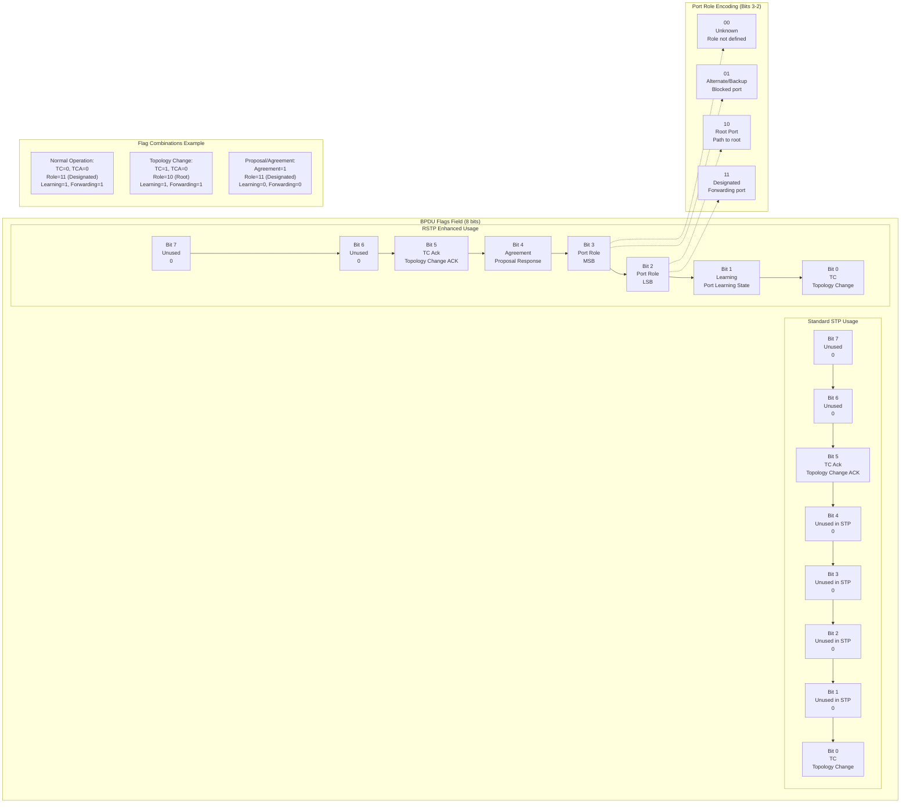

